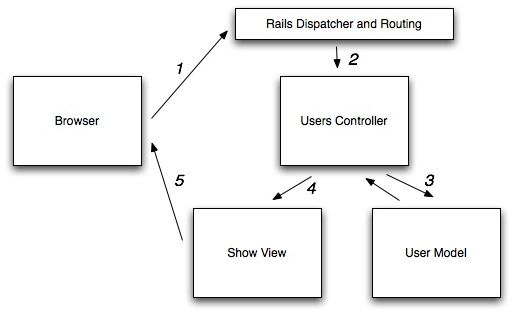

autoscale: true
footer: Blackmill
slidenumbers: true
slide-transition: fade(0.4)

[.slidenumbers: false]
# Day 2 session plan

1. Set up our app
- Intro to Rails
- Intro to TDD
- ActiveRecord (and migrations)
- Associations
- Polymorphic associations
- Optimising queries
- REST and routes
- Addressing callbacks
- What should go in ActiveRecord Models
- ActiveSupport


---
# Set up our app

App: [https://github.com/elle/survey_app](https://github.com/elle/survey_app)

1. Clone app
2. `cd survey_app`
3. Open `.ruby-version` and update with your Ruby version number. Also change Ruby version number in `Gemfile`
4. `bundle exec rails db:create`
5. `./bin/setup`

---
# Intro to Rails

---
# Rails is an MVC framework

- MVC is a design pattern that divides the responsibilities of an application to make it easier to reason about
- Model, View, Controller
- Provides support

---



---
# Models

- Nouns
- Domain objects
- Encapsulates database access

---
# Views

- Present data in a format as directed by controller
- "Presentation" layer
- Renders models for the user interface
- Typically HTML templates

---
# Controllers

- Direct traffic
- Respond to and process user actions
- Manipulate model and direct data to the view

---
# MVC gets a little help from its friends

- Web server
- Routing
- Persistence
- Database
- Caching
- Queueing/Backgrounding
- etc...

---
## App directory structure

Check `02-01-rails-structure.md`

---
# Intro to TDD

### Why?

---
# Why?

- Confidence in functionality
- Documentation
- Regression testing
- Leads to more manageable code
- Ability to refactor without fear
- Reduced requirement to test manually, which is slower, automated testing is faster
- Saves time in the long run
- Breaks down the problem
- Easier to cover edge cases

---
# Testing frameworks

- RSpec
- Minitest

---
# Naming clarification

- Unit tests
- Integration tests
- Feature tests

---
# What to test?

- Public methods
- Golden money path
- As a minimum, models and feature specs
- But other types of specs are very welcomed!

---
# Let's look at our Gemfile

And also our `/spec` dir

---
# Code time

Feel free to code along...

---
# ActiveRecord

---

[ActiveRecord docs](https://guides.rubyonrails.org/active_record_basics.html):

> Active Record is the M in MVC - the model - which is the layer of the system responsible for representing business data and logic. Active Record facilitates the creation and use of business objects whose **data requires persistent storage to a database**.

---
# ActiveRecord

When we create a new model

- Model is singular
- Controller is plural

---
# Activity

1. Generate a Question object
  - Reference `docs/survey-app.png`
  - Let's look at the generated migration

---
# Migrations

[Docs](https://guides.rubyonrails.org/v3.2/migrations.html)

## Transformations

- `{add,rename,change,remove}_column`
- `{create,drop,rename}_table`
- `{add,remove}_index`

---
# Supported types
Active Record supports the following database column types:

```ruby
:binary
:boolean
:date
:datetime
:decimal
:float
:integer
:primary_key
:string
:text
:time
:timestamp
```

---
# Helpful rake tasks

```
rake db:migrate
rake db:rollback
rake -T |grep db
```

---
# Versioning

```
ls db/migrate
rails db
select * from schema_migrations;
\q
db/schema.rb or db/structure.sql
```

---
# Associations

In Rails, an association is a connection between two ActiveRecord models.

```ruby
class Person < ApplicationRecord
  has_many :posts
end

class Post < ApplicationRecord
  belongs_to :person

  def self.most_recent
    order(created_at: :desc)
  end
end
```

[Docs](https://guides.rubyonrails.org/association_basics.html)

---
# Activity

1. Generate an Answer object
  - Reference `docs/survey-app.png`
2. Create an association between company and people, indicating some people might be admins

---
# Optimising queries

---
# Basic ActiveRecord query methods

```ruby
Person.where(first_name: "Natasha")
Person.all
Company.find(1).surveys.active.limit(5)
Post.alphabetical

class Post < ApplicationRecord
  def self.alphabetical
    order(title: :asc)
  end
end
```

---
# Domain models

```ruby
class Person < ActiveRecord::Base
  belongs_to :role
end

class Role < ActiveRecord::Base
  has_many :people
end
```

---
# Question

We need to find all the people who belong to a billable role.

Can you think of ways to achieve this?


---

```ruby
# This works, but is not optimal
Person.all.select { |person| person.role.billable? }
```

---
# Gluing tables together with the :joins method

```ruby
Person.all.joins(:role)
```

```sql
SELECT "people".*
FROM "people"
INNER JOIN "roles"
  ON "roles.id" = "people"."role_id";
```

---
```ruby
Person.all.joins(:role).where(roles: { billable: true })
```

which generates SQL like this:

```sql
SELECT "people".*
FROM "people"
INNER JOIN "roles"
  ON "roles.id" = "people"."role_id"
WHERE "roles"."billable" = 't';
```

And this query hits the database once!

---
# Separating concerns with the merge method

Does billable logic fit on `Person` or `Role`?

---

```ruby
class Role < ApplicationRecord
  def self.billable
    where(billable: true)
  end
end
```

And now, when we're querying people, we can use ActiveRecord's `merge` method to leverage this relation:

```ruby
Person.joins(:role).merge(Role.billable)
```

---
# Complete solution

```ruby
class Role < ApplicationRecord
  def self.billable
    where(billable: true)
  end
end

class Person < ApplicationRecord
  def self.billable
    joins(:role).merge(Role.billable)
  end
end

# And now we can just call
Person.billable
```


---
# Polymorphic associations

Lets' say we want comments on posts and on surveys.

A naive implementation would be to add both `post_id` and `survey_id` on the `comments` table and then in the model:

```ruby
class Comment < ApplicationRecord
  belongs_to :post
  belongs_to :survey
```

---
This is *wrong* because it implies that a single `Comment`
can connect to *both* a `Post` and a `Survey`.

Furthermore, as we add more classes that can have comments,
we will have to keep adding columns to `comments`.

---
# Setup for polymorphism

Instead, Rails' implementation of polymorphism relies on a (composite) two-factor foreign key.


```
----------------------------------------------
|id| body    |commentable_id|commentable_type|
| 1| "lorem" | 2            | "Post"         |
| 2| "ipsum" | 3            | "Post"         |
| 3| "dolor" | 3            | "Survey"       |
----------------------------------------------
```

Both `commentable_id` and `commentable_type` are foreign keys used to record the id and class name of the foreign object. Since we're now using a composite foreign key, the `commentable_id` values don't have to be unique.

---
# Activity

Add a `Comment` model to the `survey_app`

---

```ruby
# migration
rails g model Comment body:text commentable:references{polymorphic} person:references

# in Survey and Post
has_many :comments, as: :commentable

# in Comment
belongs_to :commentable, polymorphic: true
belongs_to :person

# in Person
has_many :comments
```

---
# REST and routes

What is REST?

---
Representational State Transfer (REST) is an architectural pattern.

**It aims to give a URI (uniform resource identifier) to everything that can be manipulated and let the software determine what to do from there.**

---
# REST constraints

- Server - Client
- Request-response cycle
- Stateless

---
# Why REST?

- Uniform URLs
- Structured
- Patterned

---
# What is a resource?
And how do we identify a resource?

---
# Pattern

The key is to lean into Rails' REST foundation
by making use of resources and resource for defining our routes, and ensuring we have routes like `/posts/10/comments`, and not `/getCommentsByPostId`.

---
# Defined HTTP verbs

- `GET` - retrieve data
- `POST` - add new data
- `PUT` or `PATCH` - modify data
- `DELETE` - delete data

---
# Key terms

- `resource`: the "intended conceptual target",
aka the *nouns* or actors in the business domain.
- `resource identifier`: the URL used to reach the resource
- `representation`: the response to the user in a given format, like HTML or JSON

---
# URL structure with verbs

Typical Rails RESTful routes make use of the HTTP verb and a URL:

- `GET /articles` would fetch the list of all articles
- `GET /articles/1` would fetch the single article with ID of 1
- `POST /articles` would create a new article
- `DELETE /articles/1` would delete the article with ID of 1
- `GET /articles/1/edit` to fetch the edit form
- `PUT /articles/1` would update the data for existing article with ID of 1

---
# Routes: approach example

```ruby
# config/routes.rb
resources :videos do
  member do
    get :download
  end
end

# in the controller
class VideosController < ApplicationController
  def download
    track_downloaded
    redirect_to video.download_url(download_type)
  end
end
```

---
# Routes: better approach

```ruby
# config/routes.rb
resources :videos do
  resource :download, only: [:show]
end

# controller:
class DownloadsController < ApplicationController
  def show
    track_downloaded
    redirect_to video.download_url(download_type)
  end
end
```

---
# Addressing callbacks

- What is a callback in Rails?
- Why do people hate them so much?

---
From the Rails [guides](https://guides.rubyonrails.org/active_record_callbacks.html#available-callbacks):
> > Methods that get called at certain moments of an object's life cycle. With callbacks it is possible to write code that will run whenever an Active Record object is created, saved, updated, deleted, validated, or loaded from the database.

---
# Callbacks are often a code smell

Callbacks are super powerful, but why should we use them with care?

---
ActiveRecord callbacks give us a hook into the lifecycle of an object. It is a powerful abstraction that is just magic. But before we know it, creating instances of our objects causes unwanted side effects, sometimes in unexpected places, and creating isolated tests is no longer a possibility.

---
Rails 5.1 changed the way it tracks changes in callbacks. Rails 6 added new callbacks. Callbacks themselves are not bad, it is just the way we (ab)use them that is the problem.

---
# When not to use a callback

Almost never use `after_`. And definitely never when the after action involves an additional object.

For example:

```ruby
class User < ApplicationRecord
  after_create :send_welcome_email
end
```
A better approach is creating PORO service object.

---
# Activity

Add a `slug` attribute to the `Survey` object.

Requirements:

- If we provided a custom slug, use what is provided
- If nothing was provided, generate a slug based on the Survey's name
- Slug needs to be unique within the scope of company

---
# What should go in ActiveRecord models

- ActiveRecord related
- Simple mutation methods
- Thin database wrappers
- Simple queries
- Simple constructors

---
# And what shouldn't?

- ActiveRecord callbacks
- Anything to do with the presentation layer
- Conditionals or complex application logic

---
# ActiveSupport

ActiveSupport is the collection of extensions to Ruby that Rails provides. It adds additional utility methods to core classes like Date and String to bring even more user-friendliness to Ruby's already very friendly landscape.

Check `02-11-active-support.rb`

---
# Using ActiveSupport outside of Rails

Rails includes all of Active Support by default, but luckily it exists as a standalone gem and can be included in non-Rails apps if desired.

You can load all of Active Support with:

```ruby
require "active_support/all"
```

---
or load just the extensions for a specific class like String with:

```ruby
require "active_support"
require "active_support/core_ext/string"
```

---
# Is monkey patching the world a good idea?

---
# Activity

1. Find the source code for `"string".pluralize`  
   Start with `bundle open activesupport`
2. What do the following methods do?
  - `#deep_dup`
  - `#with_options`
  - `#squish`
  - `#truncate`
  - `#inquiry`
  - `#pluck`
  - `#multiple_of?`
  - `#ordinalize`
  - `#slice`
  - `#advance`
3. What are the available options to pass in to `#truncate` and `#to_sentence`
4. When would be a good time to use `#except` or `#extract!`
5. What is `HashWithIndifferentAccess`?

---
# ActiveSupport continued...

[Docs](https://guides.rubyonrails.org/active_support_core_extensions.html)

Check `02-11-active-support-core-extensions.rb`


---
# Daily reflection ritual

[https://tally.so/r/w8aEBY](https://tally.so/r/w8aEBY)

---
# Daily feedback

[https://tally.so/r/wd9v0N](https://tally.so/r/wd9v0N)