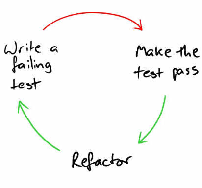
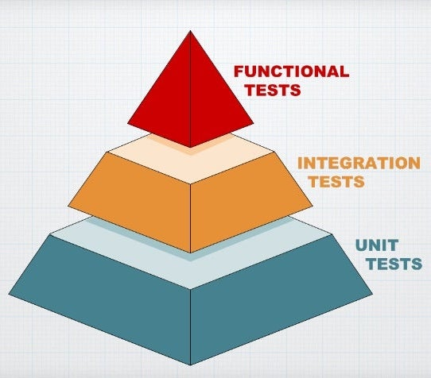

autoscale: true
footer: Blackmill
slidenumbers: true
slide-transition: fade(0.4)

[.slidenumbers: false]
# Day 3 session plan

1. TDD benefits
- The test pyramid
- The four phases of a test
- Factories vs fixtures
- Shoulda Matchers
- Test collaborators
- Testing from the outside in
- Using translations in your specs
- Controller / request specs
- Writing faster specs
- Mini retro

---
# Benefits of effective test suite

- Fast
- Complete
- Reliable
- Isolated
- Maintainable
- Expressive

---
# TDD development cycle

- TDD development cycle: Red-Green-Refactor
- Inside out
- Outside in



---
# Test pyramid


- Unit tests
  - Do not touch the database
  - Fast and cheap
- Integration tests
- Acceptance tests (feature, E2E)
  - System wide under test
  - Browser experience
  - User workflow
  - Testing multiple models
  - Slow and expensive

---
# The four phases of a test

```ruby
test do
  setup

  exercise

  verify

  teardown
end
```

Ref: [https://thoughtbot.com/blog/four-phase-test](https://thoughtbot.com/blog/four-phase-test)

---
# Fixtures

```ruby
# spec/fixtures/users.yml
bart:
  name: Bart Simpson
  email: bart@example.com

lisa:
  name: Lisa Simpson
  email: lisa@example.com

# spec/models/user_spec.rb
require "rails_helper"

describe "User" do
  describe "#first_name" do
    it "is the first part of the name" do
      user = users(:bart)

      expect(user.first_name).to eq("Bart")
    end
  end
end
```

---
# Factories

```ruby
# spec/factories.rb
FactoryBot.define do
  factory :person do
    first { "John" }
    sequence(:email) { |n| "user_#{n}@example.com" }
  end
end

# spec/models/user_spec.rb
require "rails_helper"

describe "User" do
  describe "#first_name" do
    it "is the first part of the name" do
      user = build(:user, name: "Bart Simpson") # override attributes

      expect(user.first_name).to eq("Bart")
    end
  end
end
```

---
# Fixtures and mystery guests

Fixtures often lead to Mystery Guests, an anti-pattern where we are performing some assertions in our tests but it is not at all obvious at a glance what the data we're asserting against is.

The test using a factory is a lot clearer at a glance. FactoryBot provides the ideal optimisation between hiding extraneous details from our test setup, and explicitly including the pertinent details within the spec setup.

---
# FactoryBot

**Using RSpec**

```ruby
# spec/support/factory_bot.rb
RSpec.configure do |config|
  config.include FactoryBot::Syntax::Methods
end

# auto-loaded from these locations
spec/factories.rb
spec/factories/*.rb
```

---
# FactoryBot

```ruby
FactoryBot.define do
  factory :person do
    first_name { "Andy" }
    sequence(:email) { |n| "user_#{n}@example.com" }
  end

  # Want to call your factory "admin" but use the `User` class?
  factory :admin, class: User do  
    first_name  { "Buzz"}
    email { "buzz@example.com" }
    admin { true }
  end
end
```

---

```ruby
# Having the above factory allows you to do this:
# Unsaved user (Ruby land):
user = build(:user)

# Saved user (Ruby and database land):
user = create(:user)

# Admin user:
admin = create(:admin)

# Hash of attributes for a user:
attributes = attributes_for(:user)

# Returns an object with all defined attributes stubbed out
# It makes objects look like they’ve been persisted, creates associations
user = build_stubbed(:user)
```

---
# FactoryBot — inheritance and traits

```ruby
# alternatively
FactoryBot.define do
  factory :person, aliases: [:user] do
    first_name { "Andy" }
    sequence(:email) { |n| "user_#{n}@example.com" }
    last_signed_in { 10.days.ago } # dynamic value
    github_username { "#{first_name}-github" } # dependent attribute
    
    factory :admin do
      admin { true } # create(:admin)
    end
  end
end
```

---
```ruby
# or even
FactoryBot.define do
  factory :person do
    first { "Andy" }
    sequence(:email) { |n| "user_#{n}@example.com" }
    
    trait :admin do
      admin { true }
    end
  end
end
# build(:user, :admin)
```

---
# FactoryBot - create, build, and build_stubbed

- `create` - creates the object in the database, including all its associations.
- `build` - builds the object but does not save it in the database.
- `build_stubbed` - is a little different than build, in that the object acts as though it has been persisted to the database, without actually touching the database; and it will even `build_stubbed` objects for any associations that we define in the factory as well.

---
# FactoryBot - default callbacks

factory_bot makes available four callbacks for injecting some code:

- `after(:build)` - called after a factory is built (via FactoryBot.build, FactoryBot.create)
- `before(:create)` - called before a factory is saved (via FactoryBot.create)
- `after(:create)` - called after a factory is saved (via FactoryBot.create)
- `after(:stub)` - called after a factory is stubbed (via FactoryBot.build_stubbed)

---
For example:

```ruby
# Define a factory that calls the generate_hashed_password method after it is built
factory :user do
  after(:build) { |user| generate_hashed_password(user) }
end
```

---
# FactoryBot tips

- Use one `factories.rb` file per project.
- Order `factories.rb` contents: sequences, traits, factory definitions.
- Order factory definitions alphabetically by factory name.
- Don't use [Faker](https://github.com/stympy/faker) for factories (better for seeds).
- Only define the attributes that are required for validation.

---
- Test for explicit values, avoid false positives

```ruby
# bad
describe "#full_name" do
  it "returns capitalised full name" do
    user = build(:user)

    expect(user.full_name).
      to eq "#{user.first_name} #{user.last_name}"
  end
end

# good
describe "#full_name" do
  it "returns capitalised full name" do
    user = build(:user, first_name: "john", last_name: "smith")

    expect(user.full_name).to eq "John Smith"
  end
end
```

---
# FactoryBot
### Further resources

- [FactoryBot docs: references and guides](https://thoughtbot.github.io/factory_bot/)
- [Getting Started with FactoryBot](https://github.com/thoughtbot/factory_bot/blob/main/GETTING_STARTED.md)
- [Factory Girl tips and tricks](http://arjanvandergaag.nl/blog/factory_girl_tips.html)
- [Use Factory Girl's Build Stubbed for a Faster Test](https://robots.thoughtbot.com/use-factory-girls-build-stubbed-for-a-faster-test)

---
# Shoulda Matchers

[http://matchers.shoulda.io](http://matchers.shoulda.io)


---
# Activity

1. Add validations and associations to `Person` 
2. Write and implement the specs for `Post`.
  1. Add validations specs
  2. Add associations specs

---
# Code along

In `Post` add specs for

- `.published` scope
- `.today` scope -> any posts from today only
- `.visible?(user)` scope
  - A post if visible when it belongs to a user **or** it is published
  - It is not visible if it is `draft?` ie (`published_on` is either `nil` or is in the future)

---
# Let blocks

- [Let's not](https://thoughtbot.com/blog/lets-not)
- [My issues with Let](https://thoughtbot.com/blog/my-issues-with-let)

---
# Test collaborators

Check `03-06-test-collaborators.md`

---
# Testing from the outside in

**What is BDD?**

- What is a feature test?
- What is user story?
  - A tool used to communicate user needs to software developers
  - Used in agile development
  - Describes what a user needs to do in order to fulfil job function.
- Testing from the outside in

---
# Behaviour Driven Development

**Feature test template**

As a ___________,  	
When I _________,  
And I __________  
Then I _________  
So that _________


---
# Testing from the outside in

**Examples of user stories**

- As an admin, when I visit my profile page I see all the tasks I've been assigned to complete.
- As a user, when I visit the homepage and I fill in my username and password, I can view my favourited playlists.
- As a student, when I login to the system I can purchase a parking pass.

---
# Testing from the outside in
- System under test (SUT)
- User flow
- Creating multiple objects
- Test runs in the browser, headless or not
- Slow and expensive
- Principles:
  1. Create multiple objects, and will do multiple assertions (expectations)
  2. We only test the happy path is feature specs (sad path in controller/view specs)
  3. We only assert things that we can see on the page

---
# Feature spec example

```ruby
#spec/features/user_logs_in_spec.rb
RSpec.feature "user logs in" do
  scenario "successfully"
    user = create(:user)
    visit root_path
    
    click_on "login"
    fill_in "session_email", with: user.email
    fill_in "session_password", with: user.password
    click_on "Log in"
    
    expect(page).to have_text "Signed in successfully"
  end
end
```

---
```ruby
# spec/features/user_creates_post
RSpec.feature "user creates post" do
  scenario "and publishes it" do
    user = create(:person)

    login_as user

    visit new_post_path
    fill_in :post_title, with: "Amazing news"
    fill_in :post_body, with: "Lorem ipsum"
    click_on "Publish"

    expect(page)
      .to have_text t("flash.actions.create.notice", resource_name: "Post")
    expect(page).to have_text(user.first_name)
    expect(page).to have_text "Amazing news"
    expect(page).to have_text "Published on"
  end
end
```

---
# Capybara

> Capybara helps you test web applications by simulating how a real user would interact with your app. It is agnostic about the driver running your tests and comes with Rack::Test and Selenium support built in. WebKit is supported through an external gem.

> Cuprite is a pure Ruby driver (read as no Selenium/WebDriver/ChromeDriver dependency) for Capybara. It allows you to run Capybara tests on a headless Chrome or Chromium... The design of the driver is as close to Poltergeist as possible though it's not a goal.

Ref:

- [https://github.com/teamcapybara/capybara](https://github.com/teamcapybara/capybara)
- [Capybara cheat sheet](https://devhints.io/capybara)

---
# Capybara DSL

- Navigating the session with `visit`. Using the named routes is the *preferred* option. This allows your routes to change without unnecessarily breaking the test.
- `current_path` returns the path without the protocol, server, and port. This is useful for checking that you arrive on a certain page after a previous action took place.
- Interaction with `click_on`, `fill_in`, `choose`, `check`
- Examine the response with `have_text`, `have_link`, `have_css`
- `save_and_open_page` will store the current page to a file, and open it in your default web browser. Provided by `launchy` gem. (another good one is `puts page.html`)
- Examine the HTTP status code by using `page.status_code`
- `within`

---
# Activity

Write a feature spec to log a person in and then to log out

---
# Using translations in your specs

[I18n docs](https://guides.rubyonrails.org/i18n.html)

Task: convert all the texts we used to use translations

---
```yaml
# config/locales/en.yml
en:
  application:
    user_nav:
      log_in: Log in
      log_out: Log out
  flash:
    unauthorised: Unauthorised
  sessions:
    create:
      notice: Logged in!
    destroy:
      notice: Logged out!
    new:
      log_in: Log in
  time:
    formats:
      short: "%b %d, %Y"
```

---
# Controller / request specs

Task: write specs for the sad path when the user cannot authenticate

---
# Writing faster specs

Some ideas on how

- Not creating and saving objects to database
- Limiting number of features specs and making multiple assertions in feature specs
- Not load the Rails environment

Talk by Corey Haines: [Fast Rails Tests](https://www.youtube.com/watch?v=bNn6M2vqxHE)

---
# What even is SOLID?

Does anyone remember?


---
# Mini retro and daily feedback

[https://tally.so/r/wd9v0N](https://tally.so/r/wd9v0N)

---

# End of training survey

[https://tally.so/r/w5ZrKv](https://tally.so/r/w5ZrKv)